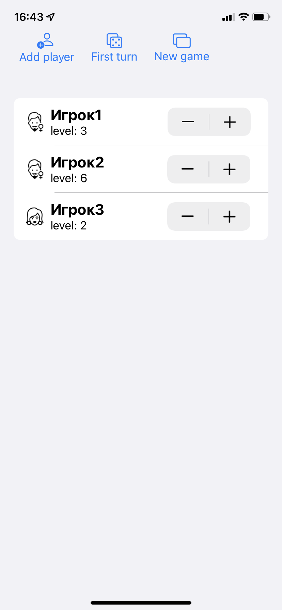

# MunchkinApp

App to implement board game counter  
Help users to store information about players (name, sex, level)  

## Features
- Adding players
- Choosing player with first turn
- Clearing current game session
- Counting level of player
- Choosing sex (male, female)
- Stored all information using CoreData

## UI

| LightMode | DarkMode |
| --------- | -------- |
| | |
